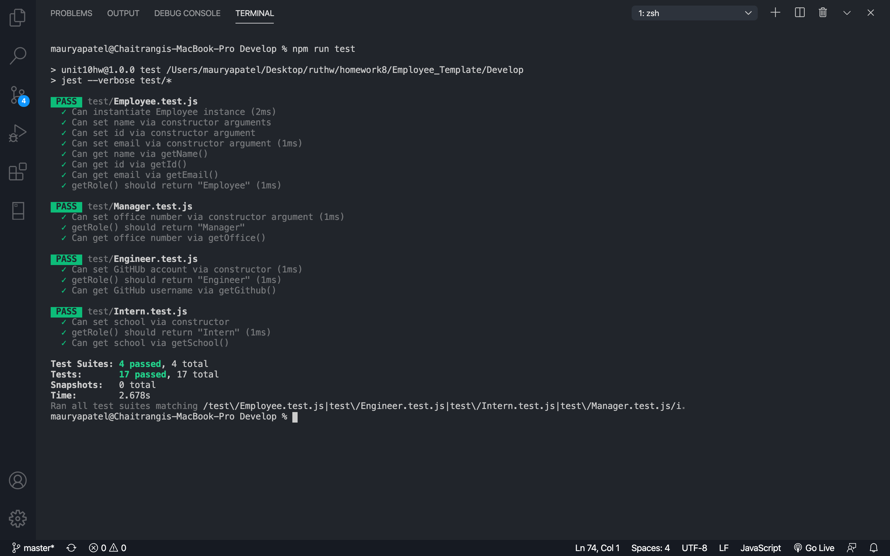
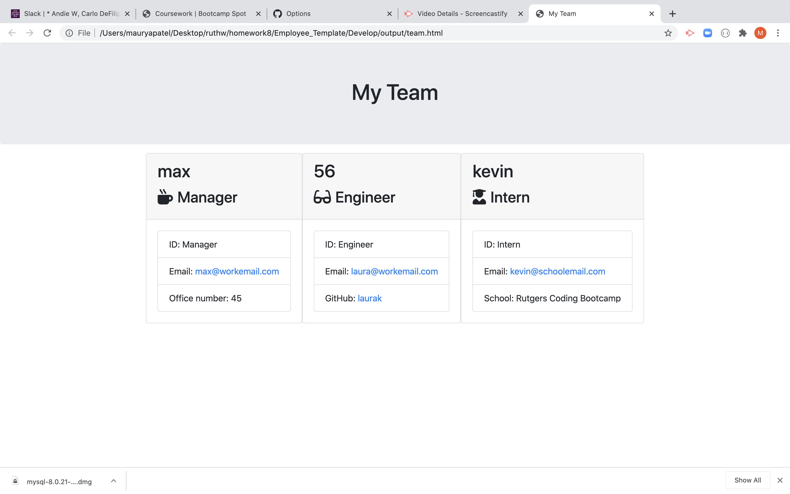

# Employee Template

# Project Summary
 In this project we were asked to create a team portfolio by asking the user about each employee's personal info and characteristics. 

# Table Contents
   - [Description](#Description)
   - [Installation Instructions](#Instructions)
   - [Project Original Contributor](#Deployer)
   - [Project Test](#Testing)
   - [Project Contributors](#Contributors)
   - [Project Questions](#Questions)
   - [Screenshot](#Deployed)
   - [Demo Link](#VideoDemo)

# Description
  This project was developed as a part of a homework assignment where the user enters information about their team and the application gives them their team's portfolio.

# Installation Instructions:
  To run this program ensure you have all the necessary node_modules, dependencies and addons required. 
  Basic dependencies such as fs, util, inquirer, async, email-validator and more are sufficient for this program. Once these dependencies are installed we can build our program. 

# Project Original Contributor: 
  This project was assigned to me as a part of a homework assignment. The source code, test files and an organized folder structure was provided to me by the professor and the TAs. I worked solely on running the tests and on the logic behind gathering and sorting the employee's information. 

# Project Test:
  Each js file was individually fixed and ran tests to ensure all files are working in orderly fashion before working on the logic of the program.

# Project Contributors:
  Anyone with a github account can contribute to this project.

# Project Questions:
  Any questions regarding this project can be directed at me via:
  - [Github Profile](https://github.com/maurya512)
  - [Email Address](patelmaurya0512@gmail.com)

# Screenshot:

# VideoDemo
https://drive.google.com/file/d/1cPhbE9jpNTz6T3wIvkcrNEiWN3q-6MCG/view

